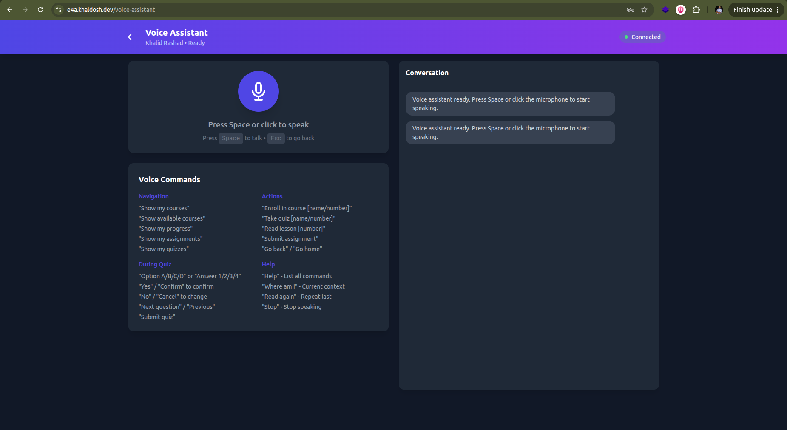
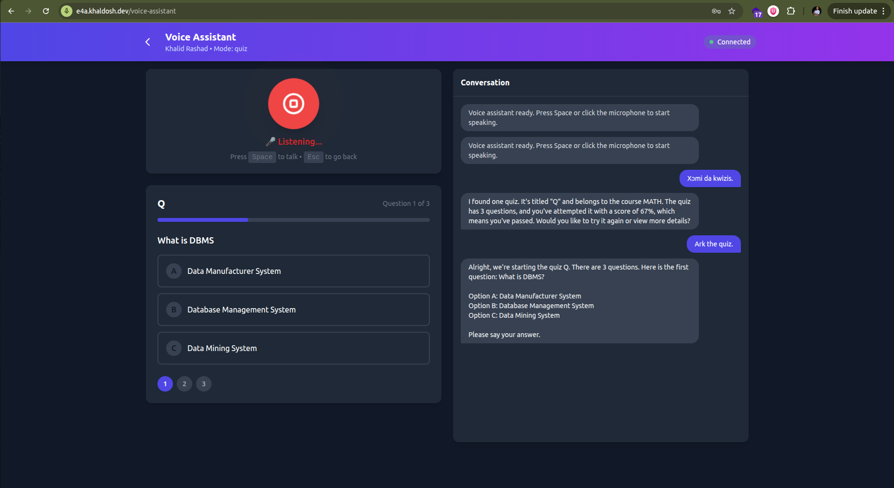
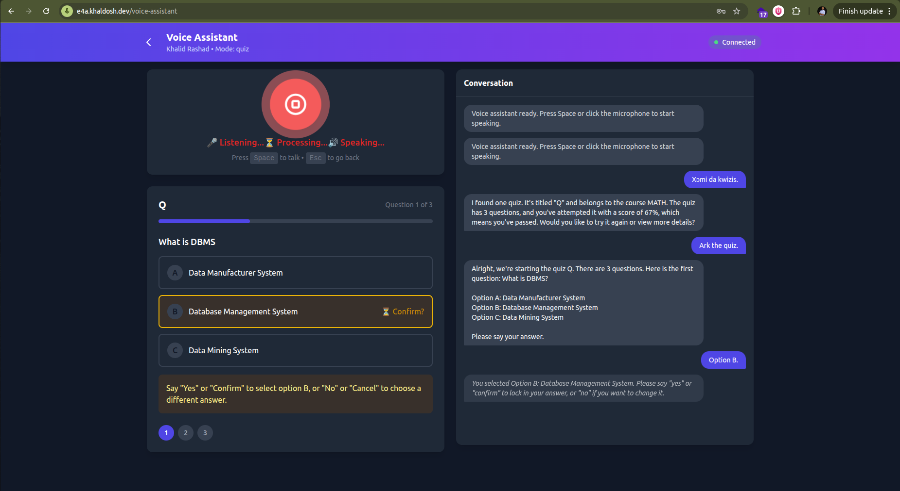
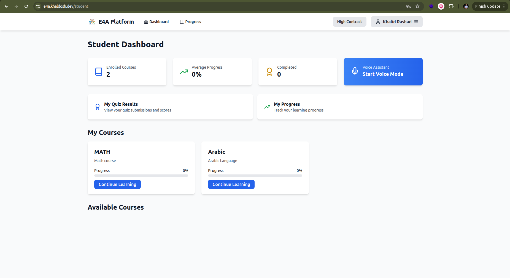
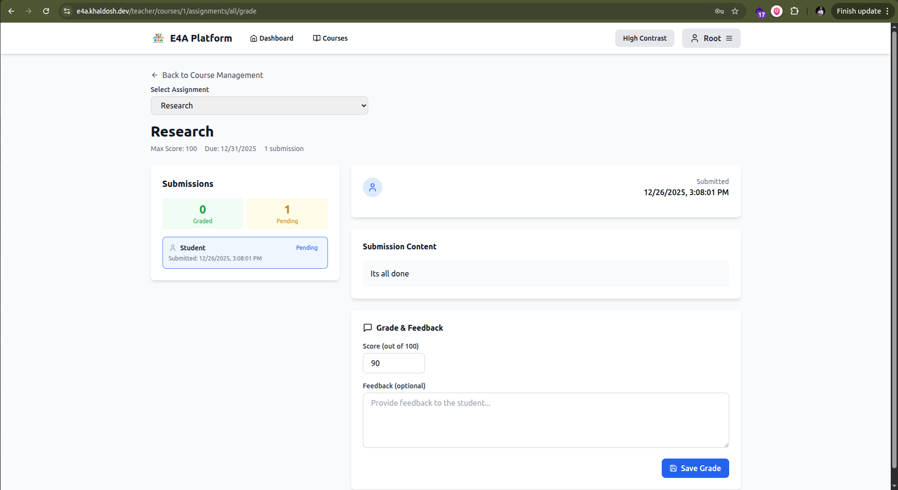

# E4APlatform

**E4APlatform** is an inclusive learning management system built to make education truly accessible for all learners, including students with disabilities. Currently, our primary focus is on supporting visually impaired students through thoughtfully designed accessibility features. At the core of the platform is a voice-first AI assistant that allows students to independently navigate courses, participate in quizzes, and submit assignments using natural voice commands, removing barriers and empowering learners to engage confidently with their education.


🌐 **Live Demo:** [https://e4a.khaldosh.dev/](https://e4a.khaldosh.dev/)  
👉 **Register a new account** to explore the platform

---

## 📋 Table of Contents
- [Features](#-features)
- [Tech Stack](#-tech-stack)
- [Getting Started](#-getting-started)
  - [Prerequisites](#prerequisites)
  - [Running with Docker Compose](#running-with-docker-compose)
- [Voice AI Assistant Guide](#-voice-ai-assistant-guide)
  - [Getting Started with Voice](#getting-started-with-voice)
  - [Voice Commands Reference](#voice-commands-reference)
  - [Taking Quizzes by Voice](#taking-quizzes-by-voice)
- [Screenshots](#-screenshots)
- [Project Structure](#-project-structure)
- [Developing Team](#development-team)
- [License](#-license)

---

## ✨ Features

### For Students
- **Voice-First Navigation**: Complete voice-controlled interface for visually impaired users
- **Course Browsing & Enrollment**: Browse available courses and enroll with voice commands
- **Interactive Lessons**: Listen to lessons with text-to-speech audio playback
- **Voice-Controlled Quizzes**: Take quizzes entirely by voice with answer confirmation
- **Assignment Submission**: Dictate and submit assignments using voice
- **Progress Tracking**: Monitor your learning progress across all courses

### For Teachers
- **Course Management**: Create and manage courses, lessons, quizzes, and assignments
- **Flexible Quiz Types**: Support for MCQ, True/False, and short answer questions
- **Auto & Manual Grading**: Choose between automatic grading or manual review
- **Grading Interface**: Review student submissions and provide detailed feedback
- **Student Analytics**: Track student progress and quiz performance
- **Assignment Review**: Grade assignments with points and written feedback

### Platform Features
- **Real-time Voice Assistant**: WebSocket-based voice interaction powered by OpenAI Realtime API
- **Audio Content**: TTS-generated audio for lessons
- **Multiple User Roles**: Student, Teacher, and Admin accounts
- **Secure Authentication**: JWT-based authentication system
- **Responsive Design**: Works on desktop and mobile devices

---

## 🛠 Tech Stack

**Backend:**
- FastAPI (Python web framework)
- SQLAlchemy (ORM)
- SQLite (development) / PostgreSQL (production)
- OpenAI Realtime API (voice assistant)
- JWT authentication

**Frontend:**
- React 18
- Vite (build tool)
- TailwindCSS (styling)
- Zustand (state management)
- WebSocket (real-time voice communication)

**Infrastructure:**
- Docker & Docker Compose
- Nginx (reverse proxy in production)

---

## 🚀 Getting Started

### Prerequisites

- Docker and Docker Compose installed on your system
- Git for cloning the repository

### Running with Docker Compose

1. **Clone the repository**

```bash
git clone https://github.com/Khaldosh249/E4APlatform.git
cd E4APlatform
```

2. **Create environment files**

Copy the example environment files and set your own values:

```bash
cp .env.example .env
cp backend/.env.example backend/.env
cp frontend/.env.example frontend/.env
```

3. **Start the application**

```bash
docker-compose up -d
```

This will start:
- **PostgreSQL database** on port 5432
- **Backend API** on port 8000
- **Frontend** on port 5173

4. **Access the application**

Open your browser and navigate to:
- Frontend: http://localhost:5173
- Backend API docs: http://localhost:8000/docs

5. **Create your first account**

Click "Register" and create a student or teacher account to get started.
Find the default admin credentials in `backend/.env` to log in as an admin.

---

## 🎤 Voice AI Assistant Guide



The voice assistant is the core feature of E4APlatform, designed to make learning accessible for visually impaired students.

### Getting Started with Voice

1. **Navigate to Voice Assistant**
   - Log in to your student account
   - Click on "Voice Assistant" in the menu

2. **Allow Microphone Access**
   - Your browser will request microphone permission
   - Click "Allow" to enable voice input

3. **Start Speaking**
   - Press `Space` to activate voice listening
   - The interface will show "🎤 Listening..."
   - Speak clearly into your microphone
   - Press `Space` again to stop listening

### Voice Commands Reference

#### Course Navigation
```
"Show my courses"              - List all enrolled courses
"Show available courses"       - Browse courses to enroll
"Enroll in course [name]"     - Enroll in a specific course
"Open course [name/number]"   - View course details
```

#### Lessons
```
"List lessons"                 - Show lessons in current course
"Open lesson [number]"         - Load a specific lesson, Then press space to listen
"Next lesson"                  - Move to the next lesson
"Mark lesson complete"         - Mark current lesson as done
```

#### Quizzes
```
"Show my quizzes"              - List all available quizzes
"Take quiz [name/number]"      - Start a quiz
"Read question"                - Repeat current question
"Next question"                - Move to next question
"Previous question"            - Go to previous question
"Submit quiz"                  - Submit your quiz answers
```

#### Assignments
```
"Show my assignments"          - List all assignments
"Start assignment [number]"    - Begin working on an assignment
"Dictate answer"               - Record your assignment response
"Submit assignment"            - Submit your work
```

#### General Navigation
```
"Show my progress"             - View learning progress
"Help"                         - List available commands
```

### Taking Quizzes by Voice



The voice quiz feature uses a confirmation flow to ensure accuracy:

1. **Start the Quiz**
   ```
   Say: "Take quiz 1" or "Take [quiz name]"
   ```

2. **Listen to the Question**
   - The assistant reads the question and all options (A, B, C, D)
   - Options are read aloud automatically

3. **Select Your Answer**
   ```
   Say: "A" or "Option A" or "Answer 1"
   ```



4. **Confirm Your Answer**
   - The assistant will repeat your selection and ask for confirmation
   - **To confirm:** Say "Yes", "Confirm", or "That's correct"
   - **To change:** Say "No", "Cancel", or "Change answer"

5. **Move Through Questions**
   ```
   Say: "Next question" or the assistant will auto-advance
   Say: "Previous question" to go back
   Say: "Question [number]" to jump to a specific question
   ```

6. **Submit the Quiz**
   ```
   Say: "Submit quiz"
   Confirm: "Yes, submit quiz"
   ```

7. **Review Results**
   - **Auto-graded quizzes:** Results shown immediately
   - **Manual-graded quizzes:** "Submitted for review" message displayed
   - Teachers will grade and you'll be notified


### Voice Assistant Troubleshooting

**Microphone not working?**
- Ensure browser has microphone permissions
- Check system microphone settings
- Try refreshing the page

**Assistant not responding?**
- Check if you see "Connected" status in the interface
- Refresh the page to reconnect
- Ensure stable internet connection

**Answers not being saved?**
- Make sure to confirm your answer when prompted
- Keep the voice session open until quiz submission
- Check for "Answer confirmed" message

**Poor voice recognition?**
- Speak clearly and at a moderate pace
- Reduce background noise
- Use a quality microphone if possible
- Speak commands in English

---

## 📸 Screenshots

### Voice Assistant Interface
<!-- Screenshot placeholder -->


### Voice Quiz Taking
<!-- Screenshot placeholder -->


### Student Dashboard
<!-- Screenshot placeholder -->


### Teacher Grading Interface
<!-- Screenshot placeholder -->


---

## 📁 Project Structure

```
E4APlatform/
├── backend/
│   ├── api/
│   │   ├── auth.py           # Authentication endpoints
│   │   ├── voice.py          # Voice assistant WebSocket handler
│   │   ├── courses.py        # Course management
│   │   ├── quizzes.py        # Quiz endpoints
│   │   └── ...
│   ├── db/
│   │   ├── models.py         # Database models
│   │   ├── users.py          # User model & functions
│   │   ├── quizzes.py        # Quiz models
│   │   └── ...
│   ├── core/
│   │   └── security.py       # JWT & security utilities
│   ├── main.py               # FastAPI application
│   └── requirements.txt      # Python dependencies
│
├── frontend/
│   ├── src/
│   │   ├── pages/            # React pages/components
│   │   │   ├── VoiceAssistantPage.jsx
│   │   │   ├── QuizTaking.jsx
│   │   │   ├── StudentDashboard.jsx
│   │   │   └── ...
│   │   ├── components/       # Reusable components
│   │   ├── lib/
│   │   │   └── api.js        # API client
│   │   └── store/            # Zustand stores
│   ├── package.json          # Node dependencies
│   └── vite.config.js        # Vite configuration
│
└── docker-compose.yml        # Docker Compose configuration
```

---

### Development Team

- **Khalid**: Backend, Infrastructure, CI/CD
- **Sarah**: Frontend, UI/UX, Documentation
- **Mwafg**: Frontend Development
- **Abdullah**: Accessibility Research (ARIA, WCAG 2.1, Keyboard Navigation)

---

## 📄 License

This project is licensed under the MIT License.

---

## 🔗 Links

- **Live Demo:** [https://e4a.khaldosh.dev/](https://e4a.khaldosh.dev/)
- **GitHub:** [https://github.com/Khaldosh249/E4APlatform](https://github.com/Khaldosh249/E4APlatform)
- **Issues:** [Report a bug or request a feature](https://github.com/Khaldosh249/E4APlatform/issues)

---

## 📞 Support

For questions, issues, or support:
- Open an issue on GitHub
- Contact the development team

---

**Made with ❤️ for accessible education**
